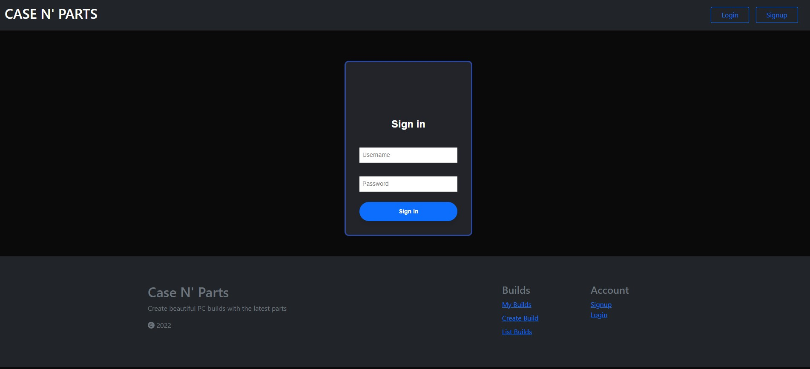

# Great Value

- Chad
- Jason
- Jarett
- Jaylon

This allows you to experiement with different parts and computer cases to build your desired PC.

## Design

- [API design](docs/apis.md)
- [Data model](docs/data-model.md)
- [GHI](docs/ghi.md)
- [Integrations](docs/integrations.md)

## Intended market

The people we would expect to use this application, are hobbiests and enthusiests.
People that care about how their PC looks, and not just that it works.

## Backend needs

- As we are unable to find an API to handle products, we create a web scraper to pull computer part details and price

### Functionality

- Users should be able to sign up for an account so that they save their builds
- Users should be able to browse through a huge database of computer hardware
- Users should be able to add parts that they want to a build list
- Users should be able to save multiple different build lists
- Users should be able to CRUD their build lists
- A part that a user adds to a build list should show a warning if the part that was added is incompatable with another part.- Users should be able to CRUD their build lists
- From the build list, users should be able to click a shop button that opens up a 3rd party site, aka Newegg, where they can see the prices for those parts.
- There should be a topdown view of a computer case where users can drag on parts that snap to the correct locations so that users can see how they look.
- Users should be able to publish their private builds to be public.
- Ability for other users to comment on builds that are made public.
- Have a rating system for each public build.
- At the end of the month, automatically show the top rated build of the month.
  - If the top rated build is tied with another in rating, use the amount of views it has to break the tie.
    - If that does not break the tie, show both builds.

## Building and running the project

First, make sure you have Docker installed on your machine.
[Docker Download](https://docs.docker.com/get-docker/)

Start Docker on your machine.

In your terminal, clone down the repository.    
`git clone <clone url here>`

CD into the directory that was made when you cloned down the repository.  

In your terminal, run this command to create a new volume that Docker can use for this project.  
`docker volume create cnp-data`

Now run this command to build a new Docker Container.  
`docker compose build`

Finally run this command to bring the container that was just made up.  
`docker compose up`

In your browser, navigate to `http://localhost:3000` to view the application.

# Visuals of site structure
## Homepage
Shows the top 3 builds and the case colors that are available on the site via a carosel.
 

## Login and signup
Allows users to sign up for an account so that they can save builds that they make on the site.
 

## List builds and my builds
Lists out all of the public builds on the site. The my builds page, only lists out the builds that the user has created.
 

## Create build
Allows you to create a build and then save it.
 

